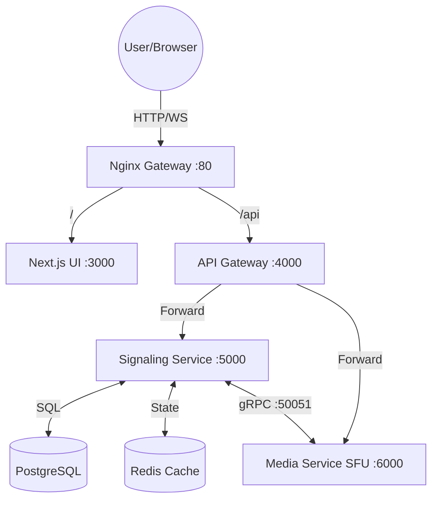
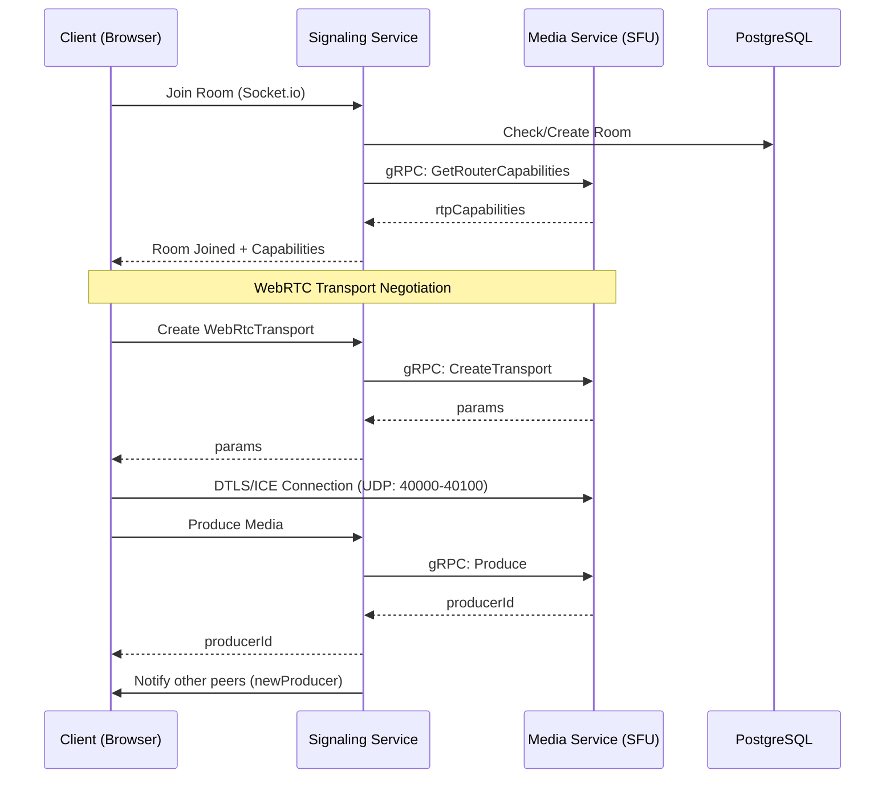

# 🎥 Real-Time Multi-Party Video Calling System

A professional-grade, microservices-based video conferencing platform built with **Next.js**, **Mediasoup (SFU)**, and **Socket.io**. This project demonstrates a scalable architecture for handling high-quality, low-latency media streams.

---

## 🏗️ Architecture Overview

The system is built on a distributed microservices model to ensure scalability and separation of concerns.

### 1. High-Level System Architecture (gRPC Powered)
This diagram shows how external traffic is routed through the Nginx gateway and how internal services communicate via **gRPC**.

### 2. Internal Communication: REST vs gRPC
| Feature | Direct REST (Old) | gRPC (Current) |
|---------------|---------------|-----------|
| **Signaling ↔ Media** | HTTP POST (20-50ms) | gRPC (2-5ms) |
| **Serialization** | JSON (Slow/Bulky) | Protobuf (Fast/Compact) |
| **Type Safety** | Runtime only | Compile-time (Proto) |

### 3. Service Communication & Call Flow

---

## 🚀 Phased Production Roadmap

I have structured the evolution of this product into three clear phases:

### **Phase 1: Performance & Reliability (Current)**
- [x] **gRPC Migration**: Internal service communication migrated to gRPC for low-latency negotiation.
- [x] **Explicit Signaling**: Improved video/audio toggle reflection via server-side broadcasting.
- [x] **SFU Stability**: Fine-tuned Mediasoup worker configuration.

### **Phase 2: Hardening & Global Access (Soon)**
- [ ] **STUN/TURN Cluster**: Deploy **Coturn** servers to bypass symmetric NATs (essential for mobile/corporate networks).
- [ ] **JWT Auth**: Secure every API and Socket.io connection with signed tokens.
- [ ] **Health Monitoring**: Advanced health checks and circuit breakers for gRPC calls.

### **Phase 3: Scaling to Millions (Growth)**
- [ ] **Multi-Core SFU**: Distribute Mediasoup workers across all available CPU cores.
- [ ] **Redis Pub/Sub**: Enable multi-instance Signaling services for global scale.
- [ ] **Pipe Transports**: Implement inter-server media routing for very large rooms.
- [ ] **Observability**: Prometheus/Grafana dashboards for real-time jitter and packet loss monitoring.

---

## 📄 License
MIT