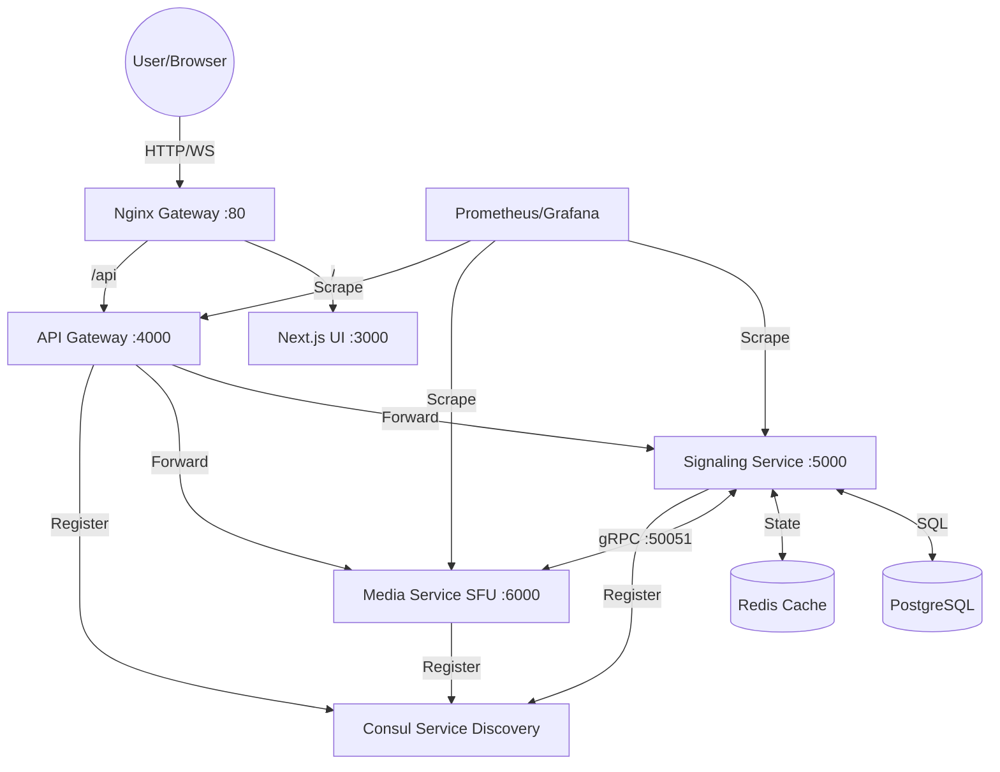
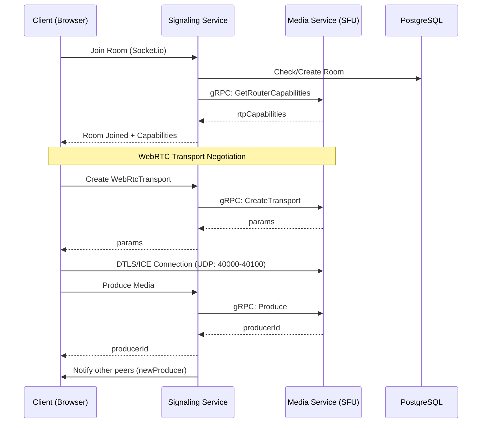

# Real-Time Multi-Party Video Calling System

A professional-grade, microservices-based video conferencing platform built with **Next.js**, **Mediasoup (SFU)**, and **Socket.io**. This project demonstrates a scalable architecture for handling high-quality, low-latency media streams with production-grade observability.

---

## Architecture Overview

The system is built on a distributed microservices model to ensure scalability and separation of concerns.

### 1. High-Level System Architecture (gRPC Powered)
This diagram shows how external traffic is routed through the Nginx gateway and how internal services communicate via **gRPC**.

### 2. Internal Communication: REST vs gRPC
| Feature | Direct REST (Old) | gRPC (Current) |
|---------------|---------------|-----------|
| **Signaling ↔ Media** | HTTP POST (20-50ms) | gRPC (2-5ms) |
| **Serialization** | JSON (Slow/Bulky) | Protobuf (Fast/Compact) |
| **Type Safety** | Runtime only | Compile-time (Proto) |

### 3. Service Communication & Call Flow

---

## 🛠️ Advanced Features

### Observability Stack
The project includes a full monitoring and discovery suite:
- **Consul**: Automated service discovery and health checks.
- **Prometheus**: Real-time metrics collection from all microservices.
- **Grafana**: Pre-configured dashboards for monitoring system health and traffic.

### Ephemeral Logging System
- **Structured Logging**: A custom `BackendLogger` in the `common` library provides JSON-structured logs with timestamps and session tracking.
- **Named Volumes**: Logs are stored in a Docker Named Volume (`backend_logs`) that is automatically cleaned up with `docker compose down -v`.
- **Log Viewer**: Access all backend logs in real-time via the browser at:  
  **[http://localhost:9000](http://localhost:9000)**

###  Premium UI Overhaul
- **Modern Aesthetics**: Dark-themed UI with advanced glassmorphism and smooth animations.
- **Custom Design System**: Refined typography, standardized icon sets (`w-6 h-6`), and polished interaction states.
- **Real-time Chat**: Fully integrated dark-themed chat with private messaging support.

---

##  Development Progress

### **Completed Foundations (Phase 1 & 2)**
- [x] **gRPC Migration**: Internal service communication for low-latency negotiation.
- [x] **Microservices**: Separation of API Gateway, Signaling, and Media services.
- [x] **SFU Stability**: Fine-tuned Mediasoup worker configuration for multi-core scaling.
- [x] **Observability**: Consul, Prometheus, and Grafana integration.
- [x] **Structured Logging**: Centralized logging with browser-based access.
- [x] **Premium UI**: Complete overhaul of the frontend user experience.

### **Scaling to Millions (Phase 3)**
- [ ] **Multi-Instance Scale**: Distribute Mediasoup workers across multiple nodes.
- [ ] **Redis Pub/Sub**: Sync signaling states across different regions.
- [ ] **STUN/TURN Cluster**: Global bypass for restrictive firewalls.
- [ ] **JWT Auth**: Production-ready security for all endpoints.

---

## 📄 License
MIT
