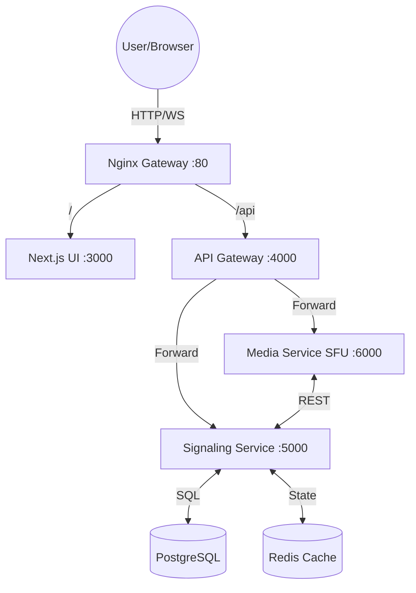
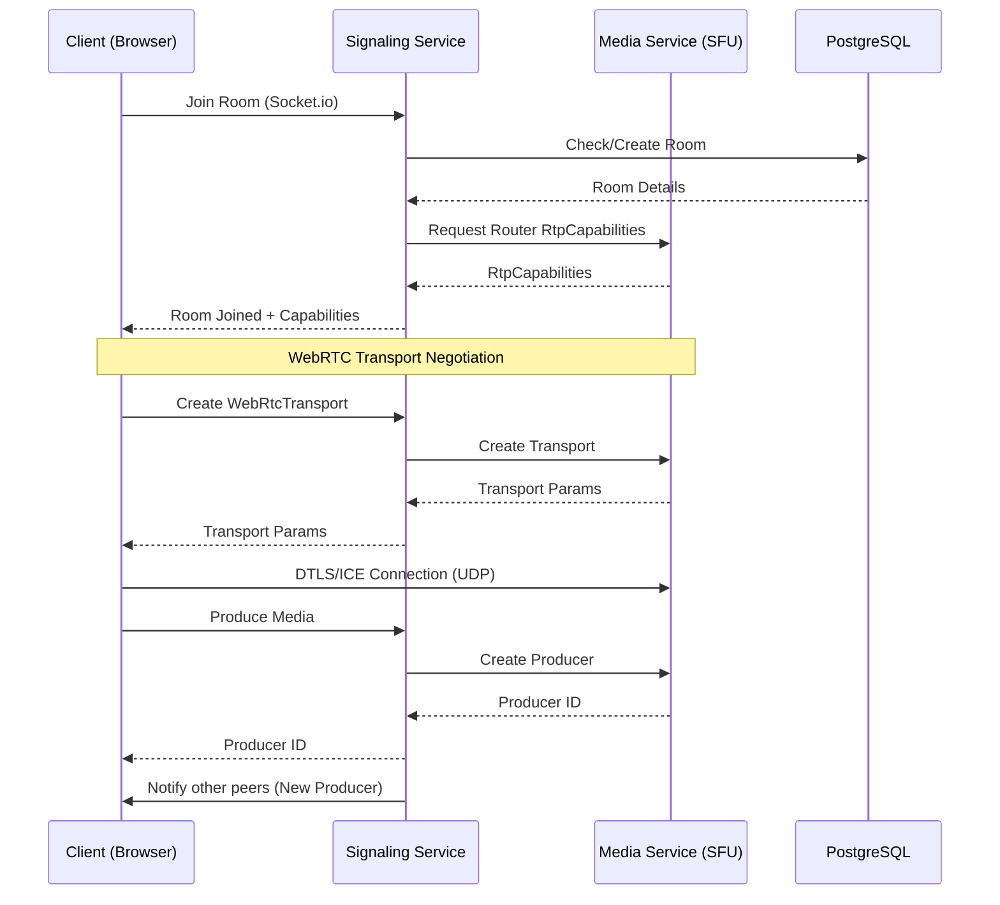
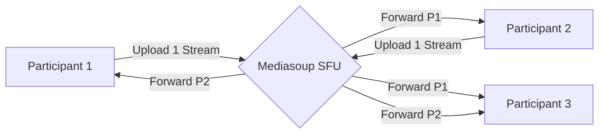

# 🎥 Real-Time Multi-Party Video Calling System

A professional-grade, microservices-based video conferencing platform built with **Next.js**, **Mediasoup (SFU)**, and **Socket.io**. This project demonstrates a scalable architecture for handling high-quality, low-latency media streams.

---

## 🏗️ Architecture Overview

The system is built on a distributed microservices model to ensure scalability and separation of concerns.

### 1. High-Level System Architecture
This diagram shows how external traffic is routed through the Nginx gateway to internal microservices.



### 2. Service Communication & Call Flow
This diagram illustrates the handshake process when a user joins a room and starts media.



### 3. Media Stream Flow (SFU Logic)
Unlike Mesh (P2P), the SFU (Selective Forwarding Unit) architecture routes media centrally.



---

## 🛠️ Backend Services

### 1. API Gateway (`server/api-gateway`)
- **Use Case**: Single entry point for the frontend.
- **Problem Solved**: Prevents exposing internal service ports; handles CORS, rate limiting, and unified routing.
- **Tech**: Node.js, Express, `http-proxy-middleware`.

### 2. Signaling Service (`server/signaling-service`)
- **Use Case**: Room management and WebRTC negotiation.
- **Problem Solved**: Enables peers to find each other and exchange SDP/ICE candidates before the media starts flowing.
- **Database**: 
    - **PostgreSQL**: Stores persistent room data (Room IDs, timestamps).
    - **Redis (Future)**: Used for horizontal scaling of Socket.io nodes.
- **Communication**: Communicates with the **Media Service** via Internal REST APIs to provision transports.

### 3. Media Service (`server/media-service`)
- **Use Case**: Selective Forwarding Unit (SFU).
- **Problem Solved**: Instead of Mesh (P2P), which fails at 3+ participants, the SFU receives 1 stream per user and forwards it to N-1 users, drastically reducing client-side bandwidth.
- **Tech**: `mediasoup`, Node.js.

---

## 💾 Database Architecture

- **PostgreSQL**: 
    - Centrally managed for the `signaling-service`.
    - Schema: `rooms` table tracks active sessions.
- **Communication**: Services connect via standard connection strings (managed via Docker environment variables).
- **Initialization**: Database tables are automatically initialized on service startup using the `common` library's pool manager.

---

## 🎨 Frontend Architecture

Built with **Next.js 14**, the frontend is designed for high performance and reactive state management.

### Key Components:
- **`useMediasoup` Hook**: The "brain" of the client. It handles:
    - Device loading (capturing capabilities).
    - Transport creation (Send/Recv).
    - Producer management (Mic/Camera/Screen).
    - Consumer management (Receiving others' streams).
- **Zustand Store**: Manages global participant state, ensuring the UI reacts instantly to join/leave events.
- **Tailwind CSS**: Provides a premium, "Glassmorphism" styled interface.

---

## 🚀 Running the Project

### Prerequisites
- Docker & Docker Compose

### Start the entire stack
```bash
docker-compose up --build
```
- **Web UI**: [http://localhost:3000](http://localhost:3000)
- **API Gateway**: [http://localhost:4000](http://localhost:4000)

---

## 📈 Roadmap for Production-Grade Scaling (Millions of Users)

To transition this from a dev environment to a production-ready system, the following improvements are recommended:

1. **Infrastructure & Orchestration**:
   - **Kubernetes (EKS/GKE)**: Deploy services as pods with Horizontal Pod Autoscalers (HPA).
   - **TURN Servers**: Deploy **Coturn** clusters to ensure 100% connectivity for users behind symmetric NATs or corporate firewalls.

2. **Media Scaling**:
   - **Mediasoup Worker Scaling**: Distribute Mediasoup workers across multiple CPU cores (currently limited to one in basic configs).
   - **Pipe Transports**: Implement Mediasoup "Pipe Transports" to allow participants in the same room to be served by different servers (Inter-server media routing).

3. **State Management**:
   - **Redis Pub/Sub**: Essential for `signaling-service` to broadcast events across multiple instances.

4. **Security**:
   - **JWT Authentication**: Secure the Room API and Socket.io connections.
   - **SRTP Encryption**: Ensure DTLS/SRTP is strictly enforced at the worker level.

5. **Observability**:
   - **Prometheus & Grafana**: Monitor Mediasoup worker load, jitter, and packet loss.
   - **ELK Stack/Loki**: For centralized logging across all microservices.

---

## 📄 License
MIT