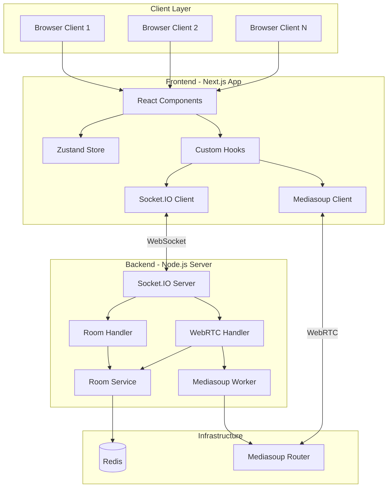
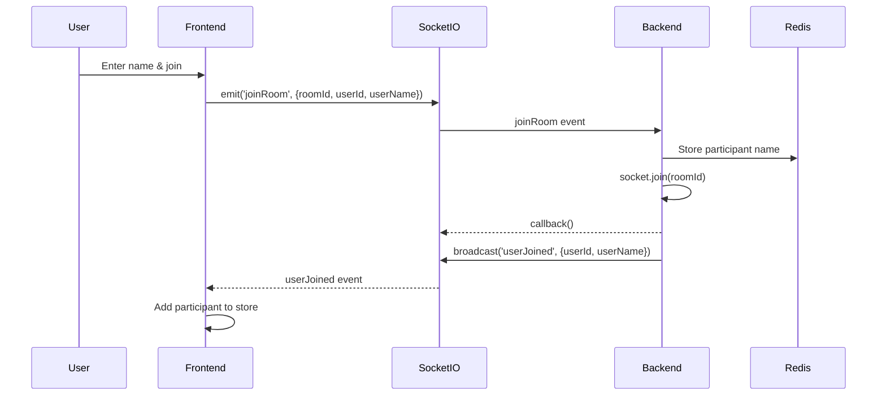
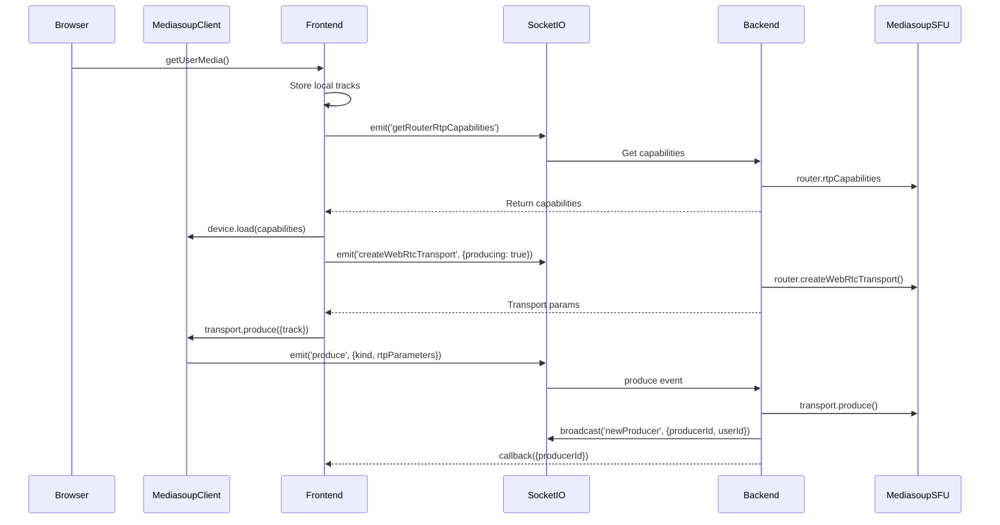
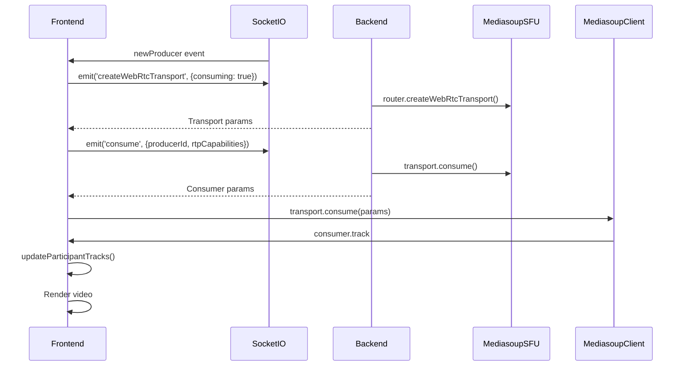
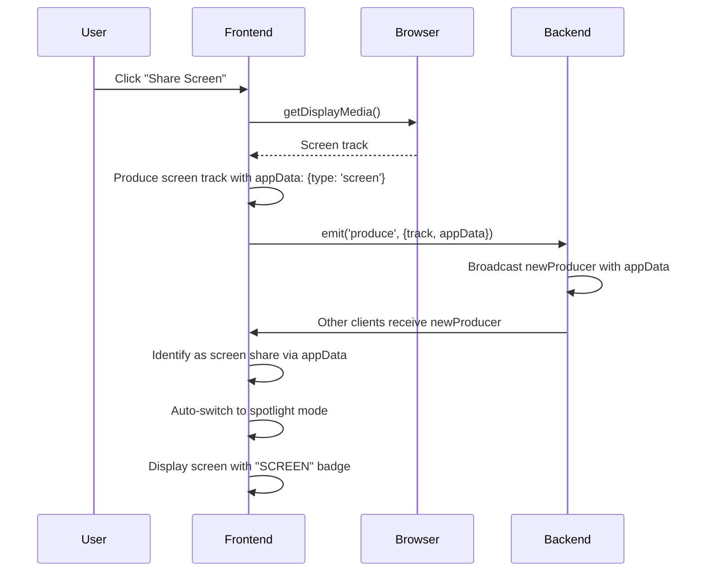

# System Architecture - Real-Time Video Calling Platform

## Overview

This is a production-ready, scalable real-time video calling platform built using **Mediasoup SFU (Selective Forwarding Unit)** architecture. The system supports multi-participant video calls, screen sharing, and dynamic participant management with a premium user interface.

## Architecture Diagram



## Technology Stack

### Frontend
- **Framework**: Next.js 14 (App Router)
- **Language**: TypeScript
- **UI Library**: React 18
- **Styling**: Tailwind CSS
- **State Management**: Zustand
- **WebRTC Client**: mediasoup-client
- **Real-time Communication**: Socket.IO Client
- **Icons**: Lucide React

### Backend
- **Runtime**: Node.js (ESM)
- **Framework**: Express.js
- **Language**: TypeScript
- **WebRTC SFU**: Mediasoup
- **Real-time Communication**: Socket.IO Server
- **State Storage**: Redis
- **Logging**: Custom Winston-based logger

### Infrastructure
- **Cache/State**: Redis (Docker)
- **Media Server**: Mediasoup Workers

## Component Architecture

### Frontend Components

#### 1. **Page Component** (`page.tsx`)
- **Purpose**: Main room page container
- **Responsibilities**:
  - Manages room joining flow
  - Handles user name input
  - Coordinates socket connection
  - Manages component lifecycle

#### 2. **NameInputModal** (`NameInputModal.tsx`)
- **Purpose**: Collects user name before joining
- **Features**:
  - Premium modal UI
  - LocalStorage persistence
  - Form validation

#### 3. **VideoGrid** (`VideoGrid.tsx`)
- **Purpose**: Displays participant video tiles
- **Modes**:
  - Grid view (all participants equal size)
  - Spotlight view (one large, others small)
- **Features**:
  - Auto-layout based on participant count
  - Screen share prioritization
  - Responsive design

#### 4. **ParticipantTile** (`ParticipantTile.tsx`)
- **Purpose**: Individual participant video display
- **Features**:
  - Video/audio track rendering
  - Screen share display
  - Name badges
  - Mute indicators
  - Pin functionality

#### 5. **Controls** (`Controls.tsx`)
- **Purpose**: Call control buttons
- **Features**:
  - Mic toggle
  - Camera toggle
  - Screen share
  - Layout switch
  - End call

### Frontend Hooks

#### 1. **useSocket** (`useSocket.ts`)
```typescript
// Manages Socket.IO connection
- Connects to signaling server
- Handles reconnection
- Returns socket instance
```

#### 2. **useMediasoup** (`useMediasoup.ts`)
```typescript
// Core WebRTC logic
- Device initialization
- Transport creation (send/receive)
- Producer management (video/audio/screen)
- Consumer management (remote streams)
- Track synchronization
```

### State Management (Zustand)

#### RoomStore (`useRoomStore.ts`)
```typescript
interface RoomState {
  roomId: string | null
  participants: Map<string, Participant>
  pinnedParticipantId: string | null
  layout: 'grid' | 'spotlight'
  
  // Actions
  upsertParticipant()
  removeParticipant()
  updateParticipantTracks()
  setLocalUserName()
  setPinnedParticipant()
  toggleLayout()
}
```

## Communication Flow

### 1. Room Join Flow



### 2. Media Publishing Flow



### 3. Media Consumption Flow



### 4. Screen Sharing Flow



## Data Flow

### Participant State Management

```typescript
// Local participant initialization
getUserMedia() 
  → upsertParticipant('local', {videoTrack, audioTrack})
  → joinRoom with userName
  → setLocalUserName(userName)

// Remote participant addition
'userJoined' event 
  → upsertParticipant(userId, {userName, isLocal: false})

// Track updates
'newProducer' event 
  → consume() 
  → updateParticipantTracks(userId, kind, track)

// Participant removal
'userLeft' event 
  → removeParticipant(userId)
```

## Signaling Events

### Client → Server

| Event | Payload | Purpose |
|-------|---------|---------|
| `joinRoom` | `{roomId, userId, userName}` | Join a room |
| `leaveRoom` | `{roomId, userId}` | Leave a room |
| `getRouterRtpCapabilities` | `{roomId}` | Get SFU capabilities |
| `createWebRtcTransport` | `{roomId, producing/consuming}` | Create transport |
| `connectWebRtcTransport` | `{transportId, dtlsParameters}` | Connect transport |
| `produce` | `{transportId, kind, rtpParameters, appData}` | Publish media |
| `consume` | `{producerId, rtpCapabilities}` | Subscribe to media |
| `producerClosed` | `{producerId}` | Close producer |
| `getProducers` | `{roomId}` | Get existing producers |

### Server → Client

| Event | Payload | Purpose |
|-------|---------|---------|
| `userJoined` | `{userId, userName}` | New participant joined |
| `userLeft` | `{userId}` | Participant left |
| `newProducer` | `{producerId, userId, appData}` | New media available |
| `producerClosed` | `{producerId}` | Media stopped |

## Scalability Considerations

### Current Architecture
- **Single Server**: One Node.js instance with Mediasoup workers
- **Single Redis**: Centralized state storage
- **Client-Side Routing**: Mediasoup SFU routes media efficiently

### Future Scaling Options
1. **Horizontal Scaling**: Multiple Mediasoup servers with load balancing
2. **Redis Cluster**: Distributed state management
3. **Room Sharding**: Distribute rooms across servers
4. **CDN Integration**: Edge servers for global distribution

## Security Features

- **WebRTC Encryption**: All media is encrypted (DTLS-SRTP)
- **Socket.IO Authentication**: Can be extended with JWT tokens
- **Room Isolation**: Participants only see their room
- **CORS Configuration**: Controlled origin access

## Performance Optimizations

1. **SFU Architecture**: Efficient bandwidth usage (no mixing)
2. **Selective Consumption**: Only consume needed streams
3. **Track Management**: Proper cleanup prevents memory leaks
4. **Immutable State**: Zustand updates prevent unnecessary re-renders
5. **Local Media Optimization**: Direct rendering without server round-trip

## Error Handling

- **Connection Failures**: Auto-reconnection logic
- **Media Errors**: Graceful fallback and user notifications
- **Transport Errors**: Automatic transport recreation
- **Producer/Consumer Cleanup**: Proper resource management on disconnect

---

**Built with ❤️ using modern web technologies for real-time communication**
