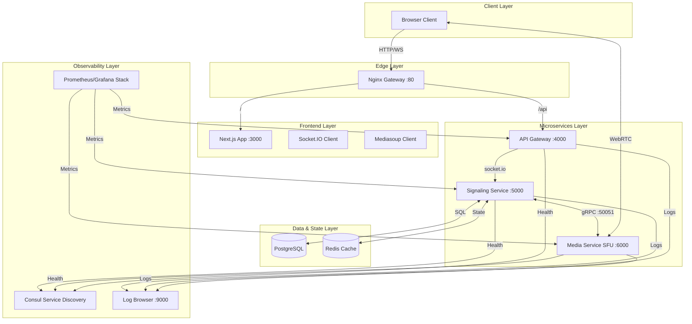

# System Architecture - Distributed Video Calling Platform

## Overview

This is a production-grade, distributed real-time video calling platform. The system is designed as a **Microservices Architecture** leveraging **Mediasoup SFU (Selective Forwarding Unit)** for media routing and **gRPC** for ultra-low latency internal service communication.

## Architecture Diagram

## Core Microservices

### 1. **API Gateway**
- **Purpose**: Unified entry point for all client requests.
- **Responsibilities**:
  - Routing traffic to the correct service.
  - Handling CORS and security headers.
  - Proxying WebSocket (Socket.IO) traffic to the Signaling Service.

### 2. **Signaling Service**
- **Purpose**: Manages room state, participant metadata, and WebRTC negotiation.
- **Responsibilities**:
  - Socket.IO connection management.
  - Participant registry (synced with Redis).
  - Orchestrating WebRTC flows via gRPC calls to the Media Service.
  - Database persistence (PostgreSQL) for room/user data.

### 3. **Media Service (SFU)**
- **Purpose**: High-performance media routing using Mediasoup.
- **Responsibilities**:
  - Managing Mediasoup Workers and Routers.
  - Creating Transports, Producers, and Consumers.
  - Handling multi-party media distribution with low overhead.
  - Exposing gRPC endpoints for remote orchestration by the Signaling service.

---

## Internal Communication: gRPC

To achieve the lowest possible latency during call negotiation, we use **gRPC (Protocol Buffers)** for all internal service calls.

| Service A | Service B | Action | Speed |
|-----------|-----------|-----------|-------|
| Signaling | Media | `GetRouterCapabilities` | < 3ms |
| Signaling | Media | `CreateWebRtcTransport` | < 5ms |
| Signaling | Media | `Produce` / `Consume` | < 2ms |

---

## Observability & Resilience

### 1. **Consul Service Discovery**
Every microservice automatically registers itself with **Consul** on startup. This ensures that services can find each other dynamically and that traffic is only routed to healthy instances.

### 2. **Prometheus & Grafana**
- **Metrics**: Each service exposes a `/metrics` endpoint.
- **Visuals**: Grafana provides real-time dashboards for CPU/Memory, Socket.IO connections, and WebRTC throughput.

### 3. **Structured Logging & Log Server**
- **BackendLogger**: A custom library handles structured JSON logging across all services.
- **Log Server**: A dedicated service picks up logs from a **Shared Named Volume** and serves them via a web UI at `http://localhost:9000`.

---

## WebRTC Flow (Distributed)

1. **Discovery**: Client joins via Socket.IO (Signaling Service).
2. **Negotiation**: Signaling service calls Media service via **gRPC** to get SFU capabilities.
3. **Transport**: Signaling service requests a transport from Media service via **gRPC**.
4. **Connection**: Client establishes a direct UDP connection to the Media service (Mediasoup SFU).
5. **Publish/Subscribe**: Signaling service manages the high-level logic (who is in the room), while Media service handles the actual bitstream routing.

## Technology Stack

### Backend
- **Node.js / TypeScript**: Core language.
- **Mediasoup**: SFU engine.
- **Socket.io**: Signaling channel.
- **gRPC / @grpc/grpc-js**: Internal RPC.
- **PostgreSQL / Prisma**: Relational data.
- **Redis**: Real-time state.

### Frontend
- **Next.js 14**: Modern UI framework.
- **Zustand**: Lightweight state management.
- **Tailwind CSS**: Premium styling.
- **Lucide Icons**: Consistent iconography.

---

**Built for SCALE. Built for PERFORMANCE.**
